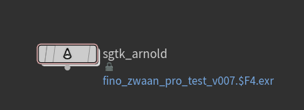
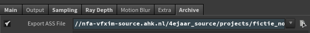
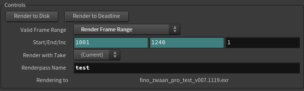
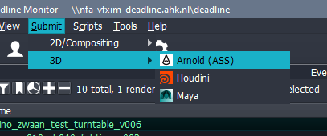
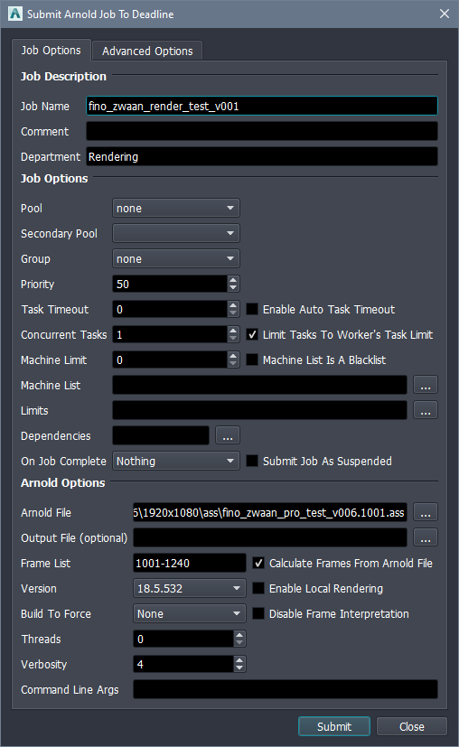
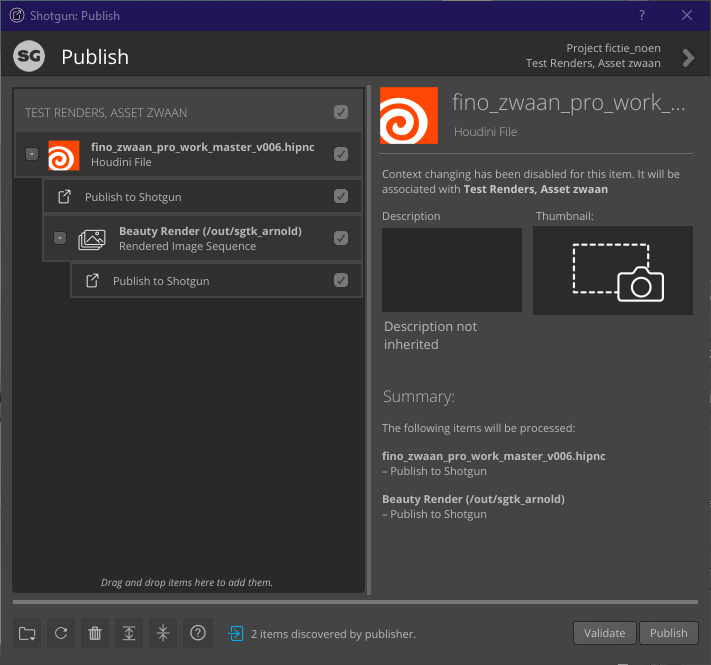
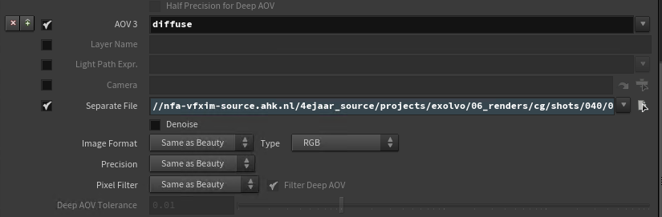

===============================================
Rendering with Arnold in the Shotgun Pipeline
===============================================

This article will guide you through the process of creating renders with *Arnold* in the *Shotgun* pipeline.

#######################################
Preparing scene and creating ASS files
#######################################

In order to properly render through the farm and *Shotgun* pipeline you will need to prepare your scene file. Start by placing a
*SGTK Arnold* node in your */out* network.

The *SGTK Arnold* node removes the standard output file options and automatically fills in any path. To render using the farm you need to enable the creation of ``.ass`` files.
Go to the *archive* tab and click *Export ASS file*.

The path should automatically be filled by the pipeline. Make sure *Render Frame Range* is selected if you would like to render a sequence and then click *Render to disk*.

The ``.ass`` file creation will now commence locally on your computer. As soon as it's done, you can submit this render through the *Arnold (ASS)* submitter in *Deadline*.

#############################
Submitting render to Deadline
#############################

To submit the ``.ass`` files sequence to *Deadline*, first, open up the *Deadline Monitor*. Inside the monitor click *Submit -> 3D -> Arnold (ASS)*.

In the opened job submitter, first name the job properly to the task at hand. All the priority and pool settings are set correctly by default. You will need to select the first frame of the ``.ass`` file sequence.
Once you have selected the first frame it will automatically correct the frame range variable. If it doesn't automatically change the variable, fill it in manually. (See screenshot below for reference).

Click submit to start rendering and see the magic happen! 

.. warning:: It's important to note that you should always check the first few frames rendered on the farm. There's a multitude of errors that can pop up that you'll need to fix manually. From locally referenced files to workers in the farm needing to be blacklisted because of inconclusive OS images.

###############################
Publishing finished renders
###############################

When the render has finished in the *Deadline Monitor* you are ready to publish your ``.exr`` image sequence. Back in *Houdini*, click on the *Shotgun* tab *-> Publish*. The *Shotgun Publisher* should automatically pick up all the rendered files. If it doesn't,
check to make sure the rendered files are actually present on the server. If you have selected any *AOV*'s you should see them as children from the main ``.exr`` file. 

Create a screenshot for every Beauty/AOV and click publish. Congrats, you're done! You should now be able to import the ``.exr`` sequence in *Nuke*.

======================
Extra's 
======================

########################
AOV's
########################

Should you want to include an *AOV* inside your render, the process is as follows:

- Add the AOV like you normally would inside Arnold. 
- Click 'render as separate file' if you don't want to merge the AOV inside the beauty render.
- The pipeline will automatically take care of the paths supplied.

.. warning:: One thing the Arnold engine + pipeline does **NOT** understand is the splitting of multiple light groups pér AOV into different EXR sequences. For these AOV sets it's best to include them inside the beauty.

.. warning:: Adding a *Cryptomatte* AOV is not as simple as adding the AOV from the selection box. See `this <https://docs.arnoldrenderer.com/display/A5AFHUG/Cryptomatte+AOVs>`_ Arnold documentation page on how to properly add cryptomatte AOV's. One important note to add that the Arnold documentation does not include is that you should disable the options *Strip Object Namespace* & *Strip Material Namespace* when rendering in Houdini.

.. sectionauthor:: Bo Kamphues