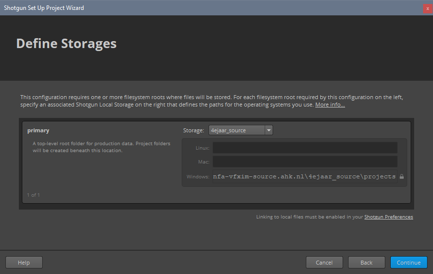

===============================================
Project Setup
===============================================

.. sectionauthor:: Bo Kamphues

This page guides you through the process of setting up projects within the current pipeline.

.. _New Project:

+++++++++++
New Project
+++++++++++

When a new project is created on *Shotgun* it is not automatically configured for use within the pipeline.
To setup a project to work with the *Shotgun Desktop* pipeline, first, add the project to *Shotgun*.

You will now see the project in the *Shotgun Desktop* project manager.

.. important:: You need to be assigned to the project you want to setup, otherwise it will not show up in *Shotgun Desktop*.

    All non-archived projects which you are assigned to are automatically shown in *Shotgun Desktop*.

Double click the project you'd like to setup and click your profile icon -> *Advanced Project Setup*.

.. figure:: resources/project_advanced.png

You'll be taken to a wizard that allows you to setup the project pipeline configuration. The type of configuration
needs to be **Git**.

After choosing *Git* as your configuration type you'll be greeted with a link box. The link to our current *Shotgun Configuration*
is ``https://github.com/nfa-vfxim/nfa-shotgun-configuration.git``. This is also the repository where most of the pipeline
development takes place.

Next you'll need a place to store the project. You can either select an already created storage location or create a new one.

Next you'll need to assign a computer-friendly name for the project. This should always be lowercase and include no spaces or special characters.

The last step before the project is correctly setup is to choose between a distributed or centralized setup. You should choose distributed here as it will download
the configuration on every individual artist PC. This is a lot faster than a centralized system where the configuration will be stored on the server itself.

.. important:: Do not choose centralized as your configuration deployment!

Click run setup and everything should be good to go!

+++++++++++++++++
Updating Projects
+++++++++++++++++

If you already have a project setup correctly, but there's been a pipeline update, you'll need to re-setup your project.

First, go to the *Shotgun* project page in your browser and make sure the ``tank_name`` field is not hidden.

Delete the content inside the ``tank_name`` field and jump to the *Pipeline Configurations* page of the project.

Delete all entities of pipeline configurations and go through the steps described in :ref:`New Project`.