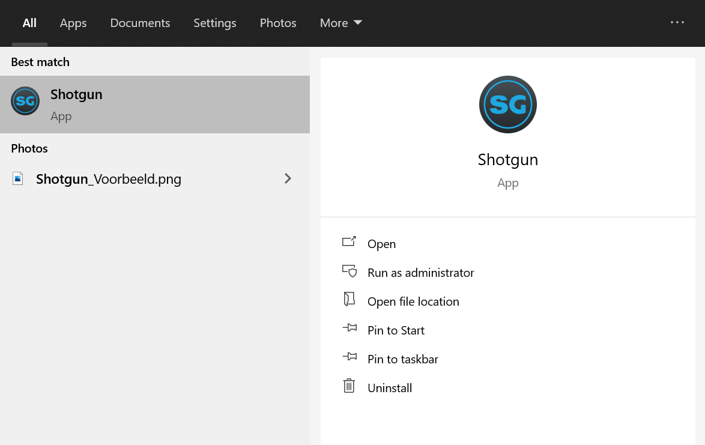
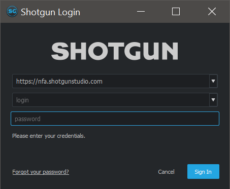
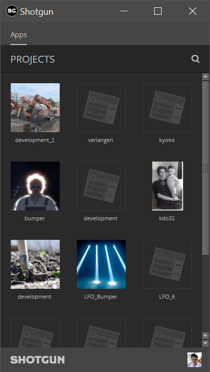
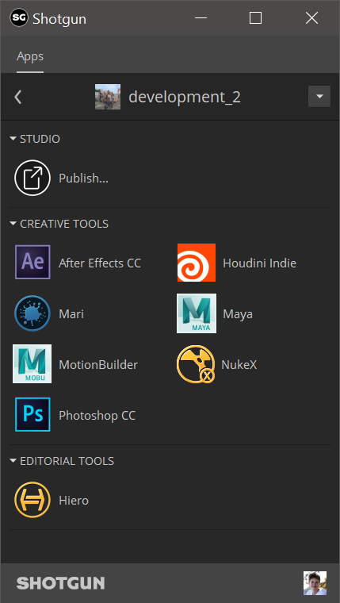

==========================
Quick Start Guide
==========================

This guide describes how to quickly get started with using the pipeline.

#####################
Start Shotgun Desktop
#####################

Technical Directors or developers in your class should have taken care of the installation of 
`Shotgun Desktop <https://support.shotgunsoftware.com/hc/en-us/articles/219040668-Desktop-download-and-setup>`_.
This program will launch your programs inside a pipeline environment in which you can load your tasks, assets, shots etc.

Shotgun Desktop can be launched by typing *Shotgun* in your Windows
search bar:

When starting Shotgun Desktop for the first time, 
you'll be greeted with a login prompt:

.. important:: Fourth and third years should be using ``https://nfa.shotgunstudio.com`` as their main task management! ``https://nfa2.shotgunstudio.com`` is meant for testing and second years.

Fill out the login info provided by your coordinator or supervisor and you'll be greeted with 
all projects you are assigned to:

.. tip:: You may need to start up Shotgun Desktop again here as it sometimes bugs out after clicking sign in.

##################
Launching DCC's
##################

Double click the project you want to work on and the pipeline configuration will automatically be downloaded.
Here you should see all the installed software that are configured with the pipeline. Double click
any package you would like to use and the pipeline does the rest.

.. warning:: *ZBrush* is currently not supported in the pipeline due to a lack of a *Python* API. Check the :ref:`zbrush_publishing` to see how you can still publish your sculpts to the pipeline.

.. sectionauthor:: Bo Kamphues