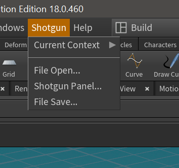
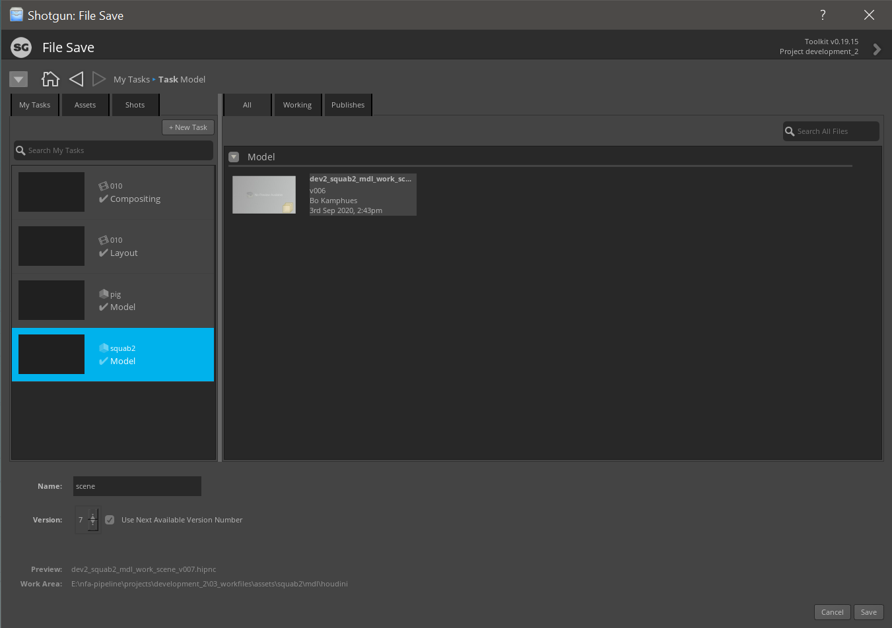
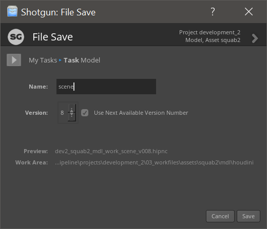
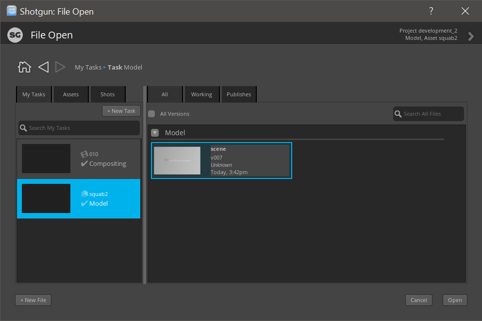
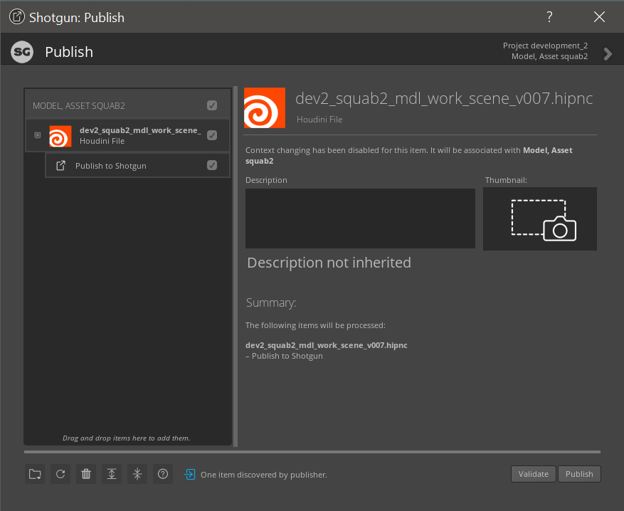
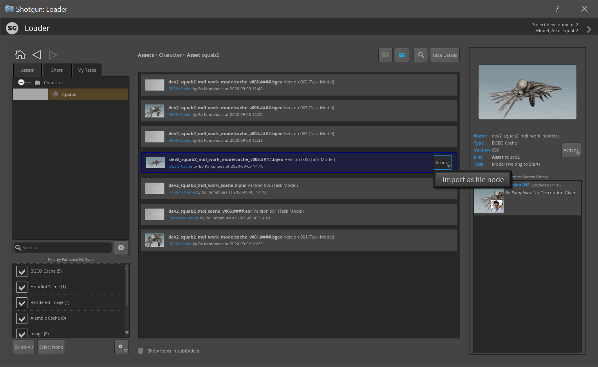
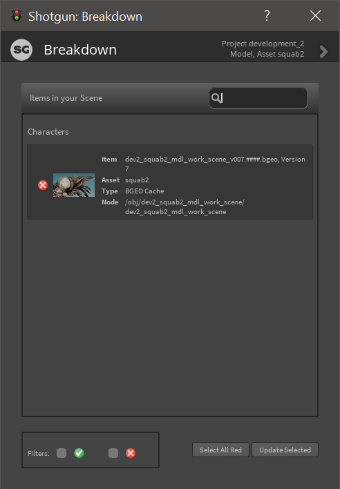

===================
Quick Usage Guide
===================

The pipeline uses *Shotgun Toolkit* as it's main platform. From within most DCC's you'll be able to open your
latest workfile  or load source files from other work into your program through the Shotgun tab.

    
    The Shotgun tab in Houdini.

There are a number of important things you can control using this tab.

++++++++++++++
File Save
++++++++++++++

On of the most important things in a pipeline is accurate version control of all the workfiles.
Through *Shotgun -> File Save* you can save your current workfile with automatic version increments.
When you click *File Save* in a new untitled save file, you'll be greeted with a context selection screen.
In this screen you'll see all shots and assets you are assigned tasks to. Select one and click save.

.. important:: As you can see in the lower left corner, there is a *name* box. This name box is filled with *scene* by default. You can change this as a way to further refine what you are working on. (If you are working on an asset that has multiple lines of workfiles, you could change this to reflect the part you are working on).

Once you have saved your empty file you can use ``ctrl + s`` to save your current file like usual.
If you'd like to save a new version of the current file you can again hit *Shotgun -> File Save* to quickly save a 
new version.

After you have saved your file through the pipeline you'll notice some more options open up, like publishing files, load, scene breakdown etc.

+++++++++
File Open
+++++++++

If you are not starting from scratch but continuing from someone else's work, you'll want to click *Shotgun -> File Open*.
In this screen you'll also be greeted with any tasks you are assigned to. When clicking on an entity you'll
see all the workfiles other artists have already made.

You can open other work files or create a new file from this context.

+++++++
Publish
+++++++

An important distinction to be made is the difference between published files and workfiles. 
Workfiles are files where the work is actively being made while published files are files meant to be loaded by
other workfiles. For example, if you have created a rig in Maya you would publish that file so that other people
can load & reference that rig. To publish the current workfile and any items that are found inside (for example
a file cache node or a set of rendered ``exr``'s) click *Shotgun -> Publish*.

If you have used a file cache node, or have rendered a file you will notice that the publisher automatically picks
up those files and creates an item for them. Use the description and thumbnail to provide reference for other people
who will load in these published files.

++++
Load
++++

The load app is used to load any published files from the project into your current work file. For example renders
from CG that need to be loaded by Nuke or a simulation that was file cached by another artist that now needs to be
loaded into the layout file.

.. important:: Obviously not all software takes in all files. (Like trying to import a ``.bgeo.sc`` cache into Nuke) The loader will automatically only show files that the current software can import.

+++++++++++++++
Scene Breakdown
+++++++++++++++

If you have loaded any assets or files from other artists there's a good chance they'll be updated every once in a while.
The scene breakdown app keeps track of all the published files you currently have imported in your workfile and shows
a red or green light if it's out-of-date or up-to-date. You can individually update or update all references.

    This particular asset has a newer version to be updated.

.. sectionauthor:: Bo Kamphues