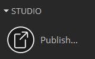
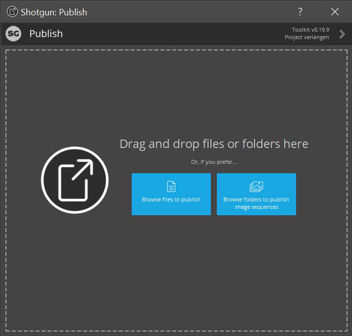
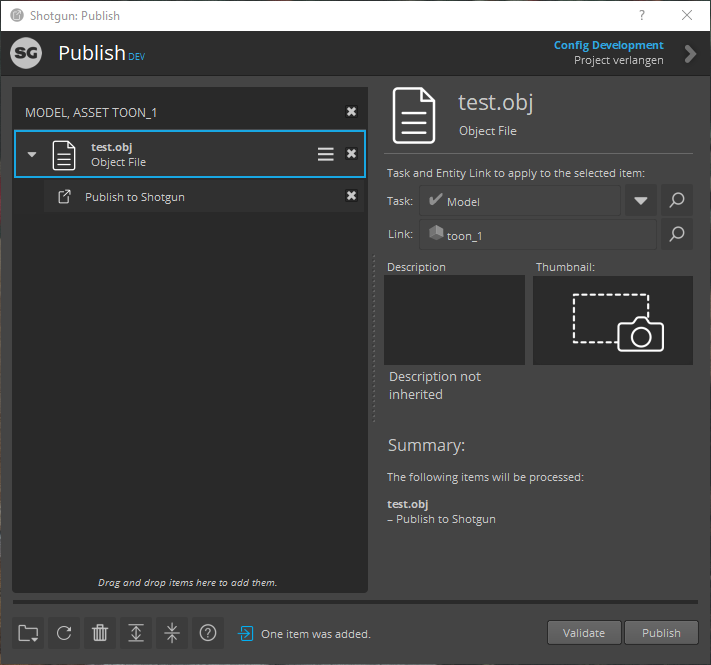

.. _zbrush_publishing:

=======================
ZBrush Publishing Guide
=======================

Unfortunately, *ZBrush* is currently not supported in the pipeline toolkit due to a lack of a *Python* API. However,
we have added the ability to upload and publish sculpts in the ``.obj`` file format to the pipeline.

Start by launching the standalone publishing app from Shotgun Desktop:

From the publishing window, either drag and drop the ``.obj`` file into the window or browse for it on your local disk.

.. important:: The publisher will rename and copy your file according to the configured naming conventions, but the publisher does need a version to make sure there are no duplicates. The file you upload should always end with a version number in between two dots. Example: ``sculpt.v001.obj``

.. warning:: The publisher will throw an error if no version number can be found or if a duplicate version has already been published.

After an ``.obj`` file has been collected by the publisher, select your task and link in the windows on the right.

Type a description describing the changes made to this task, a description of this version etc. Click on the thumbnail button to add a thumbnail for easier reference to the published file.
Click on publish to upload, copy and publish the sculpt to the rest of the pipeline.

.. sectionauthor:: Bo Kamphues